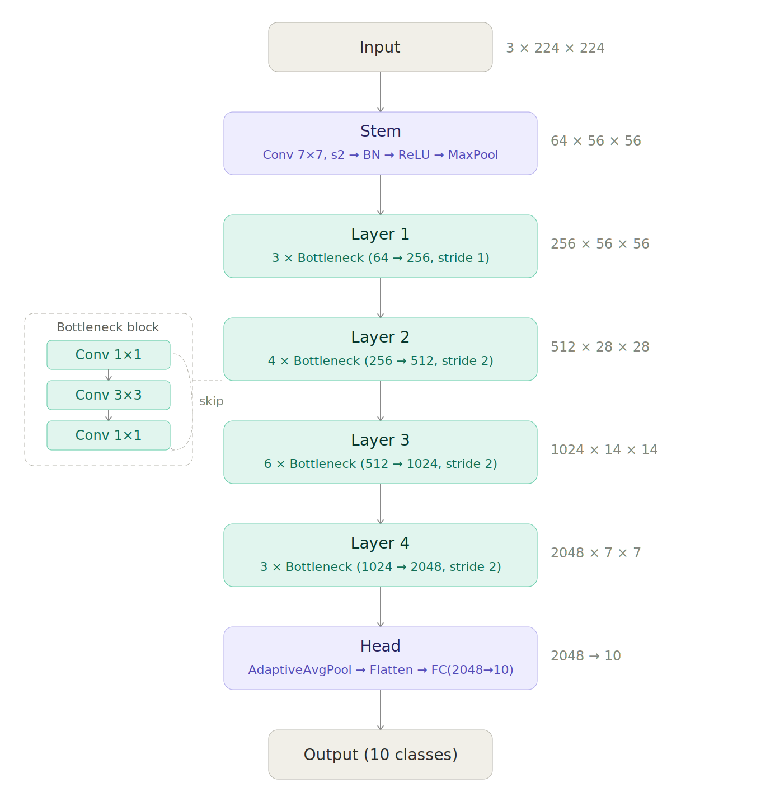

# Xây dựng ResNet50 tùy chỉnh để phân loại ảnh CIFAR-10

Dự án xây dựng và huấn luyện ResNet50 **hoàn toàn từ đầu bằng PyTorch thuần** — không dùng `torchvision.models` hay bất kỳ implementation có sẵn nào. Toàn bộ kiến trúc từ Bottleneck block, residual connection đến logic load trọng số đều được tự định nghĩa, nhằm hiểu sâu cơ chế hoạt động của ResNet thay vì chỉ gọi API.

## Kiến trúc Mô hình

Mô hình được xây từ dưới lên qua 3 lớp trừu tượng: `BotNeck` → `Layer` → `ResNet50`.

- **`BotNeck`**: Khối bottleneck tự định nghĩa, thực hiện chuỗi Conv 1×1 → 3×3 → 1×1. Shortcut connection được xử lý thủ công: dùng `Identity` nếu shape khớp, Conv 1×1 nếu cần điều chỉnh.
- **`Layer`**: Ghép nhiều `BotNeck` lại, khối đầu có thể downsampling (stride=2), các khối sau dùng stride=1.
- **`ResNet50`**: Lắp ghép toàn bộ theo đúng cấu hình gốc của ResNet50.

### Sơ đồ kiến trúc




Kiến trúc tổng quan:

1. **Stem**: Conv 7×7, stride=2 → BatchNorm → ReLU → MaxPool
2. **Residual Layers**:
   - Layer 1: 3 Bottleneck blocks (64 → 256)
   - Layer 2: 4 Bottleneck blocks (256 → 512)
   - Layer 3: 6 Bottleneck blocks (512 → 1024)
   - Layer 4: 3 Bottleneck blocks (1024 → 2048)
3. **Head**: AdaptiveAvgPool → FC(2048 → 10)

## Cài đặt

```bash
git clone https://github.com/Ta-Quang-Huy/ResNet50_Custom_Finetuning_CIFAR10.git
python -m venv .venv
.venv\Scripts\activate
pip install -r requirements.txt
```

Tải dữ liệu CIFAR-10 bằng cách chạy các cell đầu trong notebook.

## Huấn luyện và Đánh giá

**Optimizer:** Adam `lr=1e-4`, `weight_decay=1e-4` | **Batch size:** 32 | **Epochs:** 3

### Kết quả huấn luyện

| Epoch | Loss Train | Loss Val | Accuracy Val |
|:---:|:---:|:---:|:---:|
| 1 | 0.3448 | 0.1398 | 95.24% |
| 2 | 0.1139 | 0.1497 | 95.42% |
| 3 | 0.0714 | 0.1423 | 95.96% |

### Kết quả đánh giá — Test Accuracy: **95.17%**

| Class | Precision | Recall | F1-score | Support |
|:---|:---:|:---:|:---:|:---:|
| airplane | 0.95 | 0.95 | 0.95 | 1000 |
| automobile | 0.97 | 0.98 | 0.98 | 1000 |
| bird | 0.92 | 0.96 | 0.94 | 1000 |
| cat | 0.91 | 0.90 | 0.90 | 1000 |
| deer | 0.97 | 0.95 | 0.96 | 1000 |
| dog | 0.93 | 0.90 | 0.92 | 1000 |
| frog | 0.98 | 0.97 | 0.97 | 1000 |
| horse | 0.97 | 0.96 | 0.97 | 1000 |
| ship | 0.95 | 0.99 | 0.97 | 1000 |
| truck | 0.99 | 0.96 | 0.97 | 1000 |
| **avg** | **0.95** | **0.95** | **0.95** | **10000** |

## Dự đoán

```bash
python inferences.py -i <path_to_image> -w <path_to_weight>
# Ví dụ:
python inferences.py -i R.jpg -w best_model.pth
```
